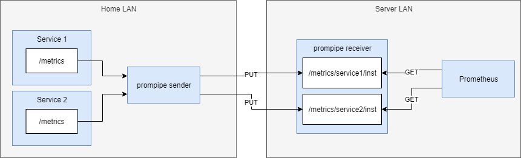

prompipe pipes your Prometheus metrics to a remote destination.

Prometheus' pull model requires Prometheus to be able to access all monitorable endpoints.
Sometimes that's not the case, and a firewall or a NAT gateway blocks this use case. For
example when you have devices you want to monitor in your own LAN, but you're running
Prometheus (and maybe Grafana) on a cloud VM.

prompipe consists of a sender (client) and a receiver (server).

The sender pulls monitorable endpoints' data and sends them to the receiver. The receiver
sits in the same network where you have your official Prometheus server, and exposes
"virtual" targets for each of your services that were in the remote LAN that you wished
to monitor.

Security
--------

PUT requests are authenticated by a bearer token.

GET requests are not authenticated, but the interfaces for PUT and GET requests are in
different ports, so you can expose only the authenticated write interface to the internet,
and have Prometheus scrape the unauthenticated metrics from the private port not exposed
to the internet.

In short, only define ingress for the authenticated 80 port.

Setup, sender
-------------

TODO

Setup, receiver
---------------

Just run the Docker image with `BEARER_TOKEN` ENV set.

You also need to setup HTTP ingress to port 80, so sender can PUT metrics.

Then you need to configure Prometheus to scrape metrics from as many endpoints as you had
for the sender. We use
[function61/promswarmconnect](https://github.com/function61/promswarmconnect) so we only
needed to define these additional ENV vars to make it happen automatically:

- `METRICS_ENDPOINT=:9090/metrics/fooservice/rpi,job=fooservice,instance=rpi`
- `METRICS_ENDPOINT2=:9090/metrics/barservice/rpi,job=barservice,instance=rpi`

Alternatives
------------

These basically do the same thing:

- https://github.com/RobustPerception/PushProx Go-based from same people who work on Prometheus, no authentication
- https://github.com/pambrose/prometheus-proxy is Kotlin/Java-based
